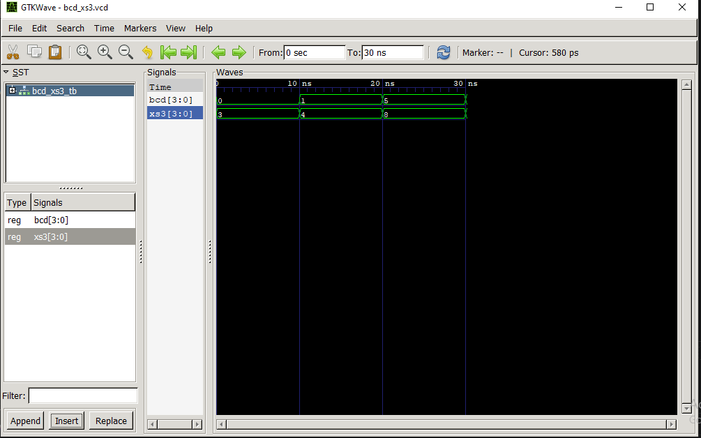
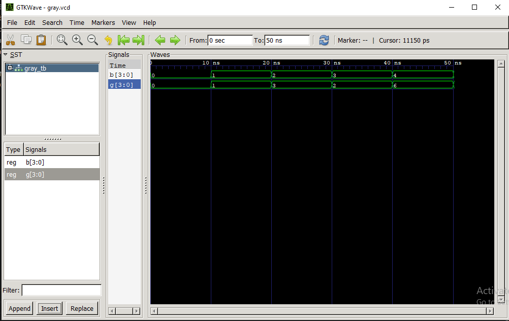

# Lab 6: VHDL Code for Combinational Circuits – Code Converter

---

## Objective

- To design and simulate a **BCD-to-Excess-3 Code Converter** using VHDL.
- To design and simulate a **Binary-to-Gray Code Converter** using VHDL.
- To verify the functionality of both combinational circuits through simulation using **GHDL** and **GTKWave**.

---

## Theory

### 1. BCD to Excess-3 Code Converter

Excess-3 (XS-3) is a non-weighted Binary Coded Decimal (BCD) code obtained by adding **3 (0011)** to each valid BCD digit. It is called a self-complementing code because the 9's complement of a decimal number can be obtained by complementing each bit of its Excess-3 representation.

The conversion is:

**Excess-3 = BCD + 3**

| Decimal | BCD | Excess-3 |
|---------|------|----------|
| 0 | 0000 | 0011 |
| 1 | 0001 | 0100 |
| 2 | 0010 | 0101 |
| 3 | 0011 | 0110 |
| 4 | 0100 | 0111 |
| 5 | 0101 | 1000 |
| 6 | 0110 | 1001 |
| 7 | 0111 | 1010 |
| 8 | 1000 | 1011 |
| 9 | 1001 | 1100 |

### Example VHDL Code

```vhdl
XS3 <= std_logic_vector(unsigned(BCD) + 3);
```

---

### 2. Binary to Gray Code Converter

Gray code is a binary numbering system in which consecutive numbers differ by only one bit. It reduces errors during transitions and is commonly used in rotary encoders, digital communication systems, and Karnaugh maps.

The conversion rules are:

- G3 = B3
- G2 = B3 XOR B2
- G1 = B2 XOR B1
- G0 = B1 XOR B0

### Example VHDL Code

```vhdl
G(3) <= B(3);
G(2) <= B(3) xor B(2);
G(1) <= B(2) xor B(1);
G(0) <= B(1) xor B(0);
```

---

## Simulation Commands

### BCD to Excess-3

```bash
ghdl -a bcd_to_xs3.vhd bcd_xs3_tb.vhd
ghdl -e BCD_XS3_TB
ghdl -r BCD_XS3_TB --vcd=bcd_xs3.vcd
gtkwave bcd_xs3.vcd
```

### Binary to Gray

```bash
ghdl -a bin_to_gray.vhd gray_tb.vhd
ghdl -e GRAY_TB
ghdl -r GRAY_TB --vcd=gray.vcd
gtkwave gray.vcd
```

---

# Output

## BCD to Excess-3 Waveform

>

## Binary to Gray Waveform

>


# Discussion

The BCD-to-Excess-3 converter correctly generated the Excess-3 code by adding three to each valid BCD input. The Binary-to-Gray converter successfully converted binary numbers into Gray code using XOR operations. The waveform obtained from GTKWave matched the expected outputs, confirming the correctness of the VHDL implementation.

The simulation also demonstrated how combinational circuits produce outputs immediately based on the current input values without requiring any clock signal.

---

# Conclusion

In this laboratory exercise, two combinational code converters were successfully designed and simulated using VHDL. The BCD-to-Excess-3 converter performed arithmetic conversion by adding three to the BCD input, while the Binary-to-Gray converter generated Gray code using XOR logic. The GHDL simulations and GTKWave waveforms verified the correctness of both designs. This lab enhanced understanding of combinational circuit design, VHDL coding, and digital logic simulation.

---