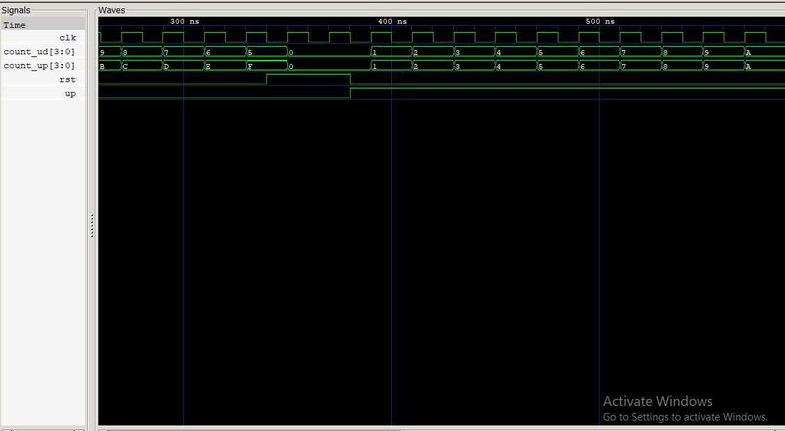

# Lab 8: VHDL Code for Sequential Circuits – Counters

## Objective

- Design and simulate a **4-bit Synchronous Up Counter** using VHDL.
- Design and simulate a **4-bit Synchronous Up/Down Counter** using VHDL.
- Verify the functionality of both counters through simulation using GHDL and GTKWave.

---

# Theory

A **counter** is a sequential digital circuit that changes its state on every clock pulse. It is constructed using flip-flops and is widely used in digital systems for counting events, generating timing signals, frequency division, and sequencing operations.

## 1. Synchronous Counter

In a synchronous counter, all flip-flops receive the same clock signal simultaneously. This eliminates the propagation delay found in asynchronous (ripple) counters, making synchronous counters faster and more reliable.

### Features
- All flip-flops are triggered by the same clock.
- Faster operation than ripple counters.
- Suitable for high-speed digital systems.

---

## 2. Up Counter

An up counter increases its binary count by one on each rising edge of the clock.

Example sequence:

| Clock Pulse | Output |
|-------------|--------|
| 0 | 0000 |
| 1 | 0001 |
| 2 | 0010 |
| 3 | 0011 |
| 4 | 0100 |
| ... | ... |
| 15 | 1111 |
| Next | 0000 |

---

## 3. Up/Down Counter

An up/down counter can either increment or decrement depending on the control signal.

- **UP = '1'** → Count Up
- **UP = '0'** → Count Down

Example:

Up counting:

```
0000 → 0001 → 0010 → 0011 → ...
```

Down counting:

```
0100 → 0011 → 0010 → 0001 → 0000 → 1111
```

---

## 4. Reset

Both counters use an **active-high synchronous reset**.

When:

```
RST = '1'
```

the counter is reset to:

```
0000
```

on the next rising clock edge.

---

# Example Code

## 4-bit Synchronous Up Counter

```vhdl
process(CLK)
begin
    if rising_edge(CLK) then
        if RST = '1' then
            count_int <= (others => '0');
        else
            count_int <= count_int + 1;
        end if;
    end if;
end process;
```

---

## 4-bit Synchronous Up/Down Counter

```vhdl
process(CLK)
begin
    if rising_edge(CLK) then
        if RST = '1' then
            count_int <= (others => '0');
        elsif UP = '1' then
            count_int <= count_int + 1;
        else
            count_int <= count_int - 1;
        end if;
    end if;
end process;
```

---

## Testbench

The testbench performs the following operations:

1. Resets both counters.
2. Counts upward for 10 clock cycles.
3. Counts downward for 5 clock cycles.
4. Resets both counters again.
5. Counts upward once more.

---

# Simulation Commands

Compile the source files:

```bash
ghdl -a counter_up.vhd counter_updown.vhd counter_tb.vhd
```

Elaborate the design:

```bash
ghdl -e COUNTER_TB
```

Run the simulation:

```bash
ghdl -r COUNTER_TB --vcd=counters.vcd
```

Open the waveform:

```bash
gtkwave counters.vcd
```

---

# Output




# Discussion

- The 4-bit synchronous up counter correctly incremented its value from **0000** to **1111** on every rising clock edge.
- The synchronous up/down counter incremented while **UP = '1'** and decremented while **UP = '0'**.
- The reset signal successfully returned both counters to **0000**.
- Simulation results observed in GTKWave matched the expected behavior of both counters.

---

# Conclusion

The objectives of this lab were successfully achieved. A 4-bit synchronous up counter and a 4-bit synchronous up/down counter were designed, implemented, and simulated using VHDL. The waveform verified that both counters responded correctly to the clock, reset, and direction control signals. This lab provided practical understanding of sequential circuits, synchronous counters, and VHDL-based digital system design.

---