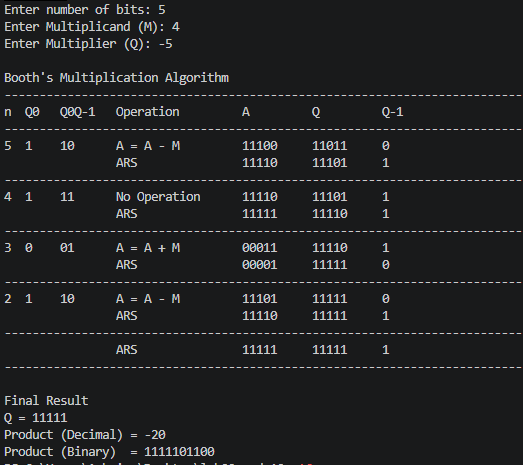
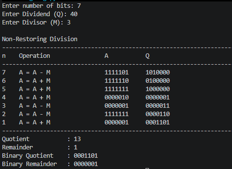

# Lab: 09 & 10

# Lab Title

**Implementation of Booth's Multiplication Algorithm and Non-Restoring Division Algorithm using Python**

# Objective

- To study the working principle of Booth's Multiplication Algorithm.
- To study the working principle of the Non-Restoring Division Algorithm.
- To implement both algorithms using Python.
- To verify the multiplication, quotient, and remainder obtained from the algorithms.

# Theory

## Booth's Multiplication Algorithm

Booth's Multiplication Algorithm is an efficient method for multiplying signed binary numbers represented in two's complement form. It examines the least significant bit of the multiplier (**Q₀**) and an additional bit (**Q₋₁**) to determine the required arithmetic operation. If **Q₀Q₋₁ = 01**, the multiplicand is added to the accumulator (**A**). If **Q₀Q₋₁ = 10**, the multiplicand is subtracted from the accumulator. If **Q₀Q₋₁ = 00** or **11**, no arithmetic operation is performed. After each operation, an arithmetic right shift is applied to the combined registers (**A, Q, Q₋₁**). This process is repeated for **n** iterations. After the final iteration, the combined contents of **A** and **Q** represent the binary product.

## Non-Restoring Division Algorithm

The Non-Restoring Division Algorithm is an efficient binary division technique used to divide unsigned binary numbers. Initially, the accumulator (**A**) is initialized to zero, the dividend is stored in the quotient register (**Q**), and the divisor is stored in register (**M**). During each iteration, the combined (**A, Q**) register is shifted left by one bit. If the accumulator is positive or zero, the divisor is subtracted from **A**; otherwise, the divisor is added to **A**. Based on the sign of the accumulator after the operation, the least significant bit (**Q₀**) is updated. After completing all iterations, if the accumulator is negative, a final restoration is performed by adding the divisor. The final contents of **Q** and **A** represent the quotient and remainder, respectively.

# Output 

# Discussion and Conclusion

Both algorithms were successfully implemented using Python. Booth's Multiplication Algorithm efficiently performs signed binary multiplication by reducing unnecessary addition and subtraction operations. The Non-Restoring Division Algorithm performs binary division without restoring the accumulator after every subtraction, making it more efficient than the restoring division algorithm.

The implementation of both algorithms helped in understanding binary arithmetic operations used in computer architecture. The results obtained from the programs matched the expected outputs for valid inputs, confirming the correctness of the implementation.

